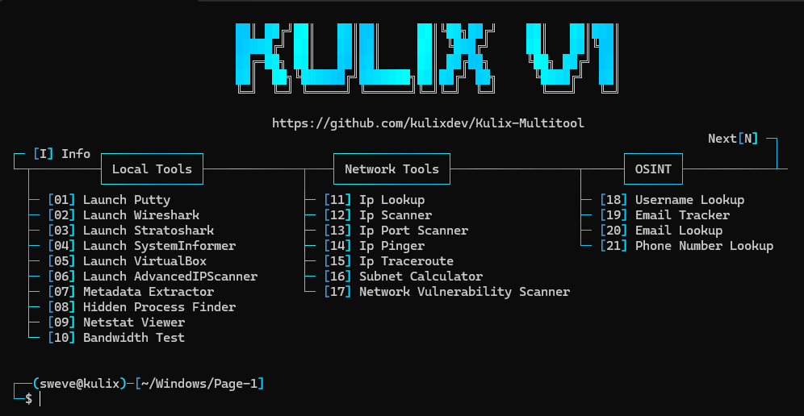
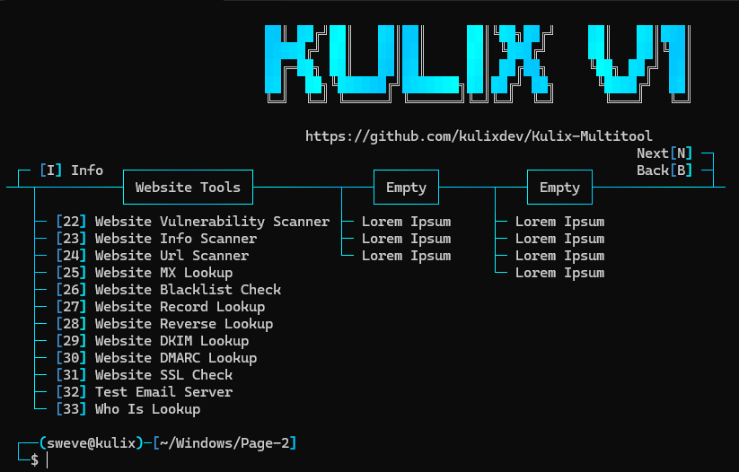

<h1 align="center">Kulix Multi Tool</h1>

<p align="center">
  
  
  
  
</p>

<p>
  - Developed solely in <strong>Python</strong>, by <a href="https://github.com/kulixdev">Kulix</a><br>
  - Tool in <strong>English</strong> only<br>
  - Available on <strong>Windows</strong> and <strong>Linux</strong><br>
  &nbsp;&nbsp;&nbsp;&nbsp; - (Some features may currently lack Linux support and have not been completley tested)<br>
  - This tool has been created for professional and testing purposes <strong>ONLY</strong>, do <strong>NOT</strong> use this tool for malicious purposes
  <br><br>
</p>

<h1 align="center">Preview</h1>

<p align="center">
   
   
  <br><br>
</p>

<h1 align="center">Available Features</h1>

<p>

```
┌── 🚀 - Local Tools
│   ├─ Launch-Putty
│   ├─ Launch-Wireshark
│   ├─ Launch-Stratoshark
│   ├─ Launch-SystemInformer
│   ├─ Launch-VirtualBox
│   ├─ Launch-AdvancedIPScanner
│   ├─ Metadata-Extractor
│   ├─ Hidden-Process-Finder
│   ├─ Netstat-Viewer
│   └─ Bandwidth-Test
│
├── 📡 - Network Tools
│   ├─ Ip-Lookup
│   ├─ Ip-Scanner
│   ├─ Ip-Port-Scanner
│   ├─ Ip-Pinger
│   ├─ Ip-Traceroute
│   ├─ Subnet-Calculator
│   └─ Network-Vulnerability-Scanner
│
├── 🔎 - OSINT
│   ├─ Username-Lookup
│   ├─ Email-Tracker
│   ├─ Email-Lookup
│   └─ Phone-Number-Lookup 
│
└── 🌐 - Website Tools
    ├─ Website-Vulnerability-Scanner
    ├─ Website-Info-Scanner
    ├─ Website-Url-Scanner
    ├─ Website-MX-Lookup
    ├─ Website-Blacklist-Check
    ├─ Website-Record-Lookup
    ├─ Website-Reverse-Lookup
    ├─ Website-DKIM-Lookup
    ├─ Website-DMARC-Lookup
    ├─ Website-SSL-Check
    ├─ Test-Email-Server
    └─ Who-Is-Lookup
```

<br><br>
</p>

<h1 align="center">System Requirements</h1>

<h3>Windows:</h3>

<p>
- Windows 10 or above<br>
- Install <a href="https://www.python.org/downloads/">Python</a> with the <a href="Core/Images/Windows_Python_Path.png">PATH</a> options<br>
</p>

<h3>Linux:</h3>

<p>
- Latest version of <a href="https://www.python.org/downloads/">Python</a><br>
- Latest Linux version (Please note that Linux support has not fully been tested yet and may have some issues)<br>
<br><br>
</p>

<h1 align="center">Tool Installation</h1>

<a href="https://github.com/kulixdev/Kulix-Multitool/releases/tag/v0.1.2-BETA">Latest release can be found here</a>

<p>

```
1 - Download your preferred file type (.zip or .tar.gz)
2 - Unzip the folder
3 - Launch "Setup.bat" to install neccessary Python libraries
```

<strong>OR</strong>

```
1 - Open a terminal
2 - Write "git clone https://github.com/kulixdev/Kulix-Multitool.git"
3 - Write "cd Kulix-Multitool"
4 - Write "git pull"
5 - Write "Setup.bat"
```

<strong>Installation Notes</strong>

Manual installation of Executables (External Software) is required<br>
&nbsp;&nbsp;&nbsp;&nbsp; - Installation links can be found in <a href="https://github.com/kulixdev/Kulix-Multitool/tree/main/Core/Programs/Reinstall">.\Core\Programs\Reinstall</a><br>
&nbsp;&nbsp;&nbsp;&nbsp; - Please than install the software to <a href="https://github.com/kulixdev/Kulix-Multitool/tree/main/Core/Programs/Software">.\Core\Programs\Software</a><br>
Executable Locations<br>
&nbsp;&nbsp;&nbsp;&nbsp; - Putty should point to .\Core\Programs\Software\putty.exe<br>
&nbsp;&nbsp;&nbsp;&nbsp; - Wireshark should point to .\Core\Programs\Software\WiresharkPortable64\WiresharkPortable64.exe<br>
&nbsp;&nbsp;&nbsp;&nbsp; - Stratoshark should point to .\Core\Programs\Software\Stratoshark\Stratoshark.exe<br>
&nbsp;&nbsp;&nbsp;&nbsp; - SystemInformer should point to .\Core\Programs\Software\SystemInformer\amd64\SystemInformer.exe<br>
&nbsp;&nbsp;&nbsp;&nbsp; - VirtualBox should point to .\Core\Programs\Software\VirtualBox\VirtualBox.exe<br>
&nbsp;&nbsp;&nbsp;&nbsp; - AdvancedIPScanner should point to .\Core\Programs\Software\AdvancedIPScanner\advanced_ip_scanner.exe<br>
Extra Information<br>
&nbsp;&nbsp;&nbsp;&nbsp; - These locations can be manually changed in <a href="https://github.com/kulixdev/Kulix-Multitool/tree/main/Core/Scripts">.\Core\Scripts\Launch-ProgramName</a><br>
&nbsp;&nbsp;&nbsp;&nbsp; - Support for the programs will be updated when possible, Linux, other versions of the software, etc<br>

<br><br>
</p>

<h1 align="center">Final Disclaimer</h1>

<p>
  - The Kulix Multitool has been created for professional and testing purposes <strong>ONLY</strong>, do <strong>NOT</strong> use this tool for malicious purposes<br><br>
  - By downloading and using the Kulix Multitool, you acknowledge and accept full responsibility for any consequences that may result from your actions in accordance with the <a href="https://www.gnu.org/licenses/gpl-3.0.en.html">GNU GENERAL PUBLIC (GPL-3.0) LICENSE</a><br><br>
  - Scripts contained within <a href="https://github.com/kulixdev/Kulix-Multitool/tree/main/Core/Scripts">.\Core\Scripts</a> may be detected by your anti-virus depending on certain actions made within the scripts (in the case a specific script is hit by your anti-virus please inform me and I will create a sub-folder for such scripts)<br><br>
<br><br>
</p>

<h1 align="center">Possible Features - Things to Do</h1>

<h3>Things to Do</h3>
<p>Ensure all scripts align with the new file structure from BETA Revision #2</p>

<h3>🌐 Website Security</h3>
<p>
- SQL Injection & XSS Scanners – Detect SQL injection and XSS vulnerabilities<br><br>
- Directory Bruteforce & Admin Finder – Locate hidden directories and common admin login pages<br><br>
- CMS Security Scanner – Scan WordPress and other CMS for security weaknesses<br><br>
- CMS Detector – Identify CMS types like WordPress, Joomla, Drupal<br><br>
- Subdomain Takeover Scanner – Find vulnerable subdomains for takeovers<br><br>
- DNS Zone Transfer Tester – Check for unauthorized DNS zone transfers<br><br>
- Header Security Checker – Analyze HTTP headers (HSTS, CSP, etc.)<br><br>
- File Inclusion Scanner – Detect LFI/RFI vulnerabilities<br><br>
</p>

<h3>🕵️ Network & OSINT</h3>
<p>
- Mac Address Lookup – Identify manufacturers from MAC addresses<br><br>
- Deep Whois Lookup – Access detailed WHOIS info, including historical data<br><br>
- IP Geolocation History – Track IP location history<br><br>
- Tor Exit Node Checker – Identify if an IP is a Tor exit node<br><br>
- Automated OSINT – Gather data from Shodan, HaveIBeenPwned, etc.<br><br>
- User-Agent Analyzer – Analyze browser user-agent strings<br><br>
- Network Sniffer & Spoof Detector – Scan WiFi networks and check for spoofing<br><br>
- Bluetooth Scanner – Discover and interact with Bluetooth devices<br><br>
</p>

<h3>🔒 Security</h3>
<p>
- Password Cracker & Hash Identifier – Crack password hashes and identify hash types (MD5, SHA256, etc.)<br><br>
- Email Spoof Tester & Spam Detector – Detect email spoofing and phishing attempts<br><br>
- Secure File Deleter & Password Tester – Erase files securely and test password strength<br><br>
- DDoS & WAF Bypass Tester – Test DDoS protection and bypass WAFs (SQLi, XSS)<br><br>
- CSRF & HTTP Request Smuggling Detectors – Scan for CSRF and HTTP smuggling vulnerabilities<br><br>
- Rate Limiting Tester – Test for rate-limiting against brute force attacks<br><br>
- DNS Rebinding & CORS Detectors – Detect DNS rebinding and misconfigured CORS settings<br><br>
</p>

<h3>🛡️ Privacy</h3>
<p>
- Leak Detector – Scan social media/data breaches for leaked data (employee, project details)<br><br>
- Cloud Bucket Finder – Detect misconfigured cloud storage exposing data<br><br>
- Phishing Site Detector – Identify likely phishing sites using known datasets<br><br>
- API Key Exposure Scanner – Find exposed API keys on public sites<br><br>
</p>

<h3>📊 Performance</h3>
<p>
- Web App Performance Tester – Analyze and optimize website load times<br><br>
- File Extension Detector – Verify allowed file types on websites/networks<br><br>
</p>
