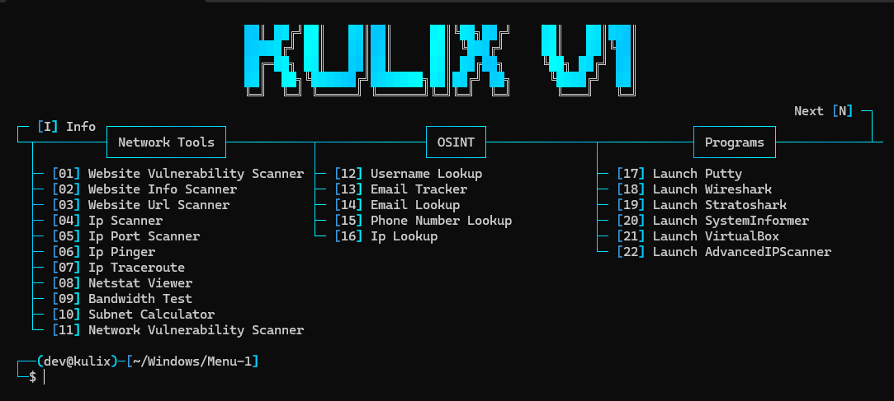
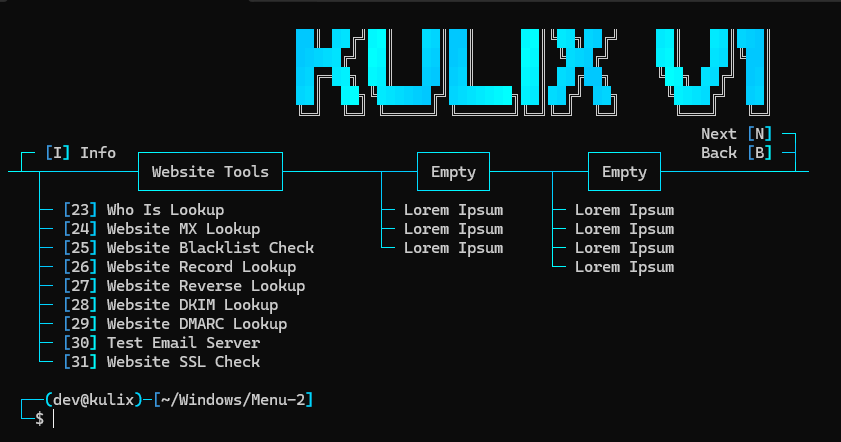

<h1 align="center">Kulix Multi Tool</h1>

<p align="center">
  
  
  
  
</p>

<p>
  - Developed solely in <strong>Python</strong>, by <a href="https://github.com/kulixdev">Kulix</a><br>
  - Tool in <strong>English</strong> only<br>
  - Available on <strong>Windows</strong> and <strong>Linux</strong><br>
  &nbsp;&nbsp;&nbsp;&nbsp; - (Some features may currently lack Linux support and have not been completley tested)<br>
  - This tool has been created for professional and testing purposes <strong>ONLY</strong>, do <strong>NOT</strong> use this tool for malicious purposes
  <br><br>
</p>

<h1 align="center">Preview</h1>

<p align="center">
   
   
  <br><br>
</p>

<h1 align="center">Available Features</h1>

<p>

```
┌── 📡 - Network Tools
│   ├─ Info
│   └─ Site
│
├── 🔎 - OSINT
│   ├─ Username Lookup
│   ├─ Email Tracker
│   ├─ Email Lookup
│   ├─ Phone Number Lookup
│   └─ IP Lookup
│
├── 🚀 - Program Launcher
│   ├─ Putty
│   ├─ Wireshark
│   ├─ Stratoshark
│   ├─ SystemInformer
│   ├─ VirtualBox
│   └─ AdvancedIPScanner
│
└── 🌐 - Website Tools
    ├─ Who Is Lookup
    ├─ Website MX Lookup
    ├─ Website Blacklist Check
    ├─ Website Reverse Lookup
    ├─ Website Record Lookup
    ├─ Website DKIM Lookup
    ├─ Website DMARC Lookup
    ├─ Test Email Server
    └─ Website SSL Check
```

<br><br>
</p>

<h1 align="center">System Requirements</h1>

<h3>Windows:</h3>

<p>
- Windows 10 or above<br>
- Install <a href="https://www.python.org/downloads/">Python</a> with the <a href="Images/Windows_Python_Path.png">PATH</a> options<br>
</p>

<h3>Linux:</h3>

<p>
- Latest version of <a href="https://www.python.org/downloads/">Python</a><br>
- Latest Linux version (Please note that Linux support has not fully been tested yet and may have some issues)<br>
<br><br>
</p>

<h1 align="center">Tool Installation</h1>

<a href="https://github.com/kulixdev/Kulix-Multitool/releases/tag/v0.1-BETA">Latest release can be found here</a>

<p>

```
1 - Download your preferred file type (.zip or .tar.gz)
2 - Unzip the folder
3 - Launch "Setup.bat" to install neccessary Python libraries
```

<strong>OR</strong>

```
1 - Open a terminal
2 - Write "git clone https://github.com/kulixdev/Kulix-Multitool.git"
3 - Write "cd Kulix-Multitool"
4 - Write "git pull"
5 - Write "Setup.bat"
```

<strong>Installation Notes</strong>

Manual installation of Executables (External Software) is required<br>
&nbsp;&nbsp;&nbsp;&nbsp; - Installation links can be found in <a href="https://github.com/kulixdev/Kulix-Multitool/tree/main/Executables/Reinstall">.\Executables\Reinstall</a><br>
&nbsp;&nbsp;&nbsp;&nbsp; - Please than install the software to <a href="https://github.com/kulixdev/Kulix-Multitool/tree/main/Executables/Portables">.\Executables\Portables</a><br>
Executable Locations<br>
&nbsp;&nbsp;&nbsp;&nbsp; - Putty should point to .\Executables\Portables\putty.exe<br>
&nbsp;&nbsp;&nbsp;&nbsp; - Wireshark should point to .\Executables\Portables\WiresharkPortable64\WiresharkPortable64.exe<br>
&nbsp;&nbsp;&nbsp;&nbsp; - Stratoshark should point to .\Executables\Portables\Stratoshark\Stratoshark.exe<br>
&nbsp;&nbsp;&nbsp;&nbsp; - SystemInformer should point to .\Executables\Portables\SystemInformer\amd64\SystemInformer.exe<br>
&nbsp;&nbsp;&nbsp;&nbsp; - VirtualBox should point to .\Executables\Portables\VirtualBox\VirtualBox.exe<br>
&nbsp;&nbsp;&nbsp;&nbsp; - AdvancedIPScanner should point to .\Executables\Portables\AdvancedIPScanner\advanced_ip_scanner.exe<br>
Extra Information<br>
&nbsp;&nbsp;&nbsp;&nbsp; - These locations can be manually changed in <a href="https://github.com/kulixdev/Kulix-Multitool/tree/main/Program">.\Program\Launch-ProgramName</a><br>
&nbsp;&nbsp;&nbsp;&nbsp; - Support for the programs will be updated when possible, Linux, other versions of the software, etc<br>

<br><br>
</p>

<h1 align="center">Final Disclaimer</h1>

<p>
  - The Kulix Multitool has been created for professional and testing purposes <strong>ONLY</strong>, do <strong>NOT</strong> use this tool for malicious purposes<br><br>
  - By downloading and using the Kulix Multitool, you acknowledge and accept full responsibility for any consequences that may result from your actions in accordance with the <a href="https://www.gnu.org/licenses/gpl-3.0.en.html">GNU GENERAL PUBLIC (GPL-3.0) LICENSE</a><br><br>
  - Scripts contained within <a href="https://github.com/kulixdev/Kulix-Multitool/tree/main/Program">.\Program</a> may be detected by your anti-virus depending on certain actions made within the scripts (in the case a specific script is hit by your anti-virus please inform me and I will create a sub-folder for such scripts)<br><br>
  - When changing Menus with 'N' or 'B' the process may be caught by your anti-virus as this writes to the file here <a href="https://github.com/kulixdev/Kulix-Multitool/blob/main/Program/Config/Menu.txt">.\Program\Config\Menu.txt</a> to store your menu number<br><br>
<br><br>
</p>
